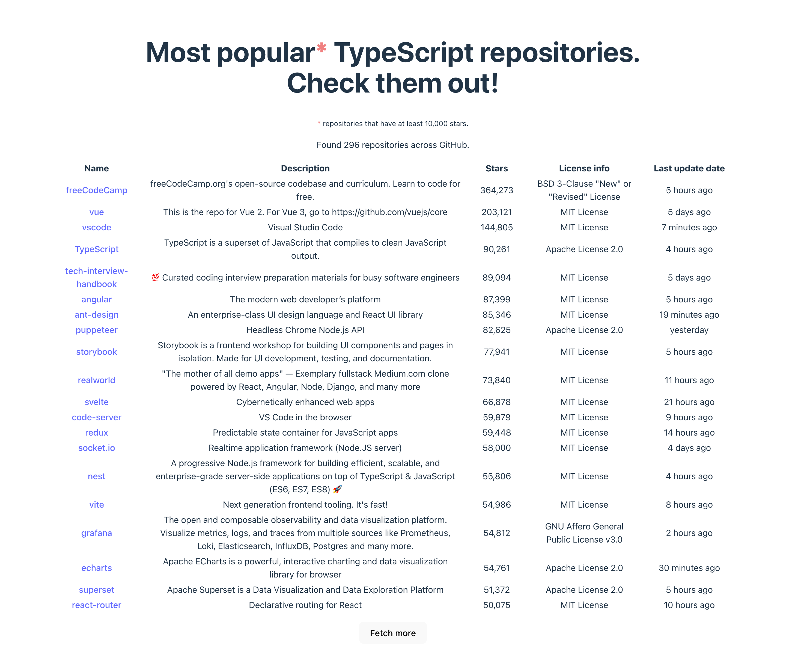

# GitHub's Popular TypeScript Repositories



## How to start the app locally

Clone this reposirtory:

```bash
git clone https://github.com/artischockee/github-popular-typescript-repos.git
```

Navigate to the repo directory:

```bash
cd github-popular-typescript-repos/
```

Install required dependencies:

```bash
npm install
```

Run `dev` script with your personal GitHub token provided (replace `YOUR_TOKEN` with the token):

```bash
VITE_GITHUB_TOKEN=YOUR_TOKEN npm run dev
```
